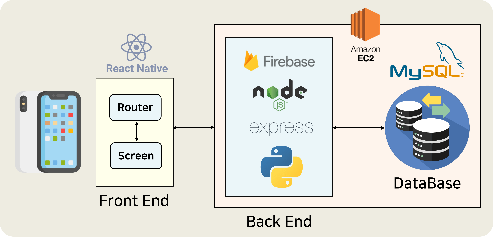

# Keyword_Notification(2021.01 - 2021.03)
> 2021 KEY Team Project

## 🏡 팀 소개

안녕하세요! 팀 KEY입니다.

- [김승은](https://github.com/julie0005)
- [김예원](https://github.com/yeye921)
- [박윤정](https://github.com/pyj127)
- [우다현](https://github.com/defwdahyun0)
- [한동민](https://github.com/handevmin)

## 🔑 **서비스 소개**

<br/>

학교 공지사항에서 프로그램을 신청하려고 봤더니, 신청기한이 지난 적이 있으신가요?

학교 홈페이지, 학과 홈페이지를 돌아다니며 공지사항을 확인하기 힘드신가요?

매일 공지사항을 확인하기 어려우신가요?

이제 `아주키워드`에서 원하는 정보 알림을 받아보세요!

<br/>

- 회원가입/로그인을 하고,
- 키워드를 추가해보세요.
- 알림을 받아볼 수 있습니다!
- 나에게 딱 맞는 알림을 키워드를 설정하고, 모아서 알림을 받아보세요!

<br/>

## 1. Technology used
 
<br/>

**BackEnd** `Node.js` `Amazon EC2` `ExpressJS`

**Database** `MySQL` `MySQLWorkBench`

**crawling** `Python`

**Server** `AWS EC2` `Firebase`

**FrontEnd** `ReactNative`

**Version Control** `Git`

**Repository** `Github`

**Tools** `Visual Studio Code` `Notion` `Microsoft 365`

<br/>

## 2. Directory description
### 2.1 api
    - AWS EC2 서버 구조
[README](https://github.com/julie0005/Keyword_Notification/blob/master/api/README.md)

### 2.2 app-front
    - 앱 컴포넌트 및 UI, 기능 제작
[README](https://github.com/julie0005/Keyword_Notification/blob/master/app-front/README.md)

### 2.3 db
     - 웹 크롤링 및 데이터베이스 관리
[README](https://github.com/julie0005/Keyword_Notification/blob/master/db/README.md)

### 2.4 meeting_note
    - 회의록, notion으로 기록 후 옮김

<br/>

## 3. Development result

### 로그인 화면


#### id 찾기 화면

#### 비밀번호 찾기 화면

#### 회원가입 화면


### Main 화면


#### keyword 추가 화면

#### Setting 화면


<br/>

## 4. Structure



### 동작 구조

#### Python

1. 주기적인 크롤링을 하여 crawl에 최신 5개 게시물 저장
2. 저장 전 그 테이블의 이전 5개 게시물과 내용이 다르면 새로운 게시물로 판단하고 저장
3. A 페이지의 새로운 게시물들의 제목에 대해서 A 페이지에 해당하는 사용자들이 등록한 키워드(로컬 디비 이용)가 있는지 판단
4. 있다면 (페이지, 키워드)를 주제로 구독한 사용자들에게 푸시알림을 보내라고 firebase에 요청
5. firebase는 (페이지, 키워드)가 주제인 사용자들에게 fcm(firebase-cloud-mesasging) 수행.

#### Node

1. 프론트의 API에 대해 각 기능 수행 [API 문서 참조](https://github.com/julie0005/Keyword_Notification/blob/master/api/README.md)

#### React-Native

1. 사용자가 페이지 지정 후 키워드 등록을 하면, (페이지, 키워드)를 주제로 firebase에 구독함.
2. 사용자가 키워드 삭제 시 firebase에서 사용자 토큰을 이용하여 삭제.
3. (페이지, 키워드) 주제를 구독한 사용자가 없게 되면 해당 주제 삭제.

## 5. How to process

### 5.1. Running front-end

``` bash
# go to directory
$ cd app-front

# install dependencies
$ npm install # Or yarn install

# build for production and launch server
$ cd android
$ gradlew build

# generate and start project
$ npx react-native start
$ npx react-native run-android

```
### 5.2. Running back-end

``` bash
# go to directory
$ cd api/app

# install node and npm (in ubuntu)
$ sudo apt-get update 
$ sudo apt-get install nodejs
$ sudo apt-get install npm
$ npm init --yes
$ npm install

# start node server with exit state(background)    
$ nohup npm start &
$ exit

# start node server with auto_modifying state(Daemon process)
$ nohup nodemon </dev/null &
$ exit
```
## 6. contact
    e-mail: keywordalarmi@gmail.com
